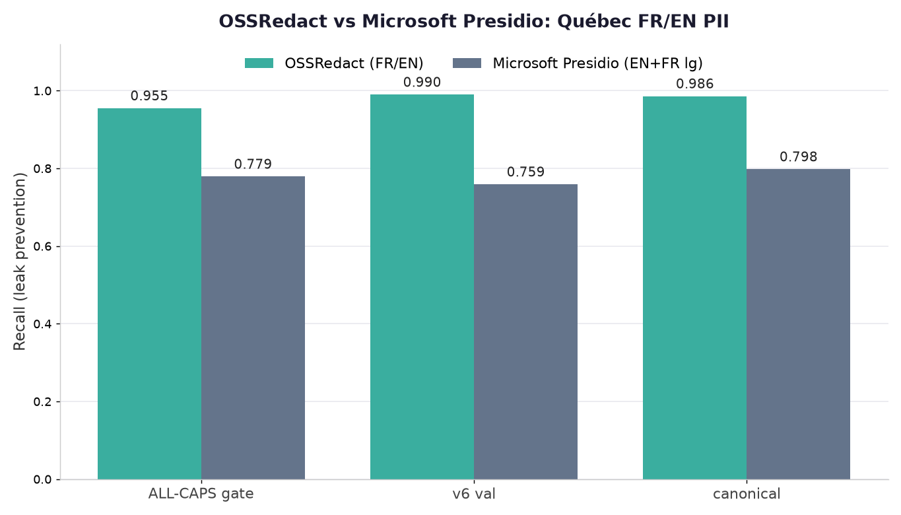
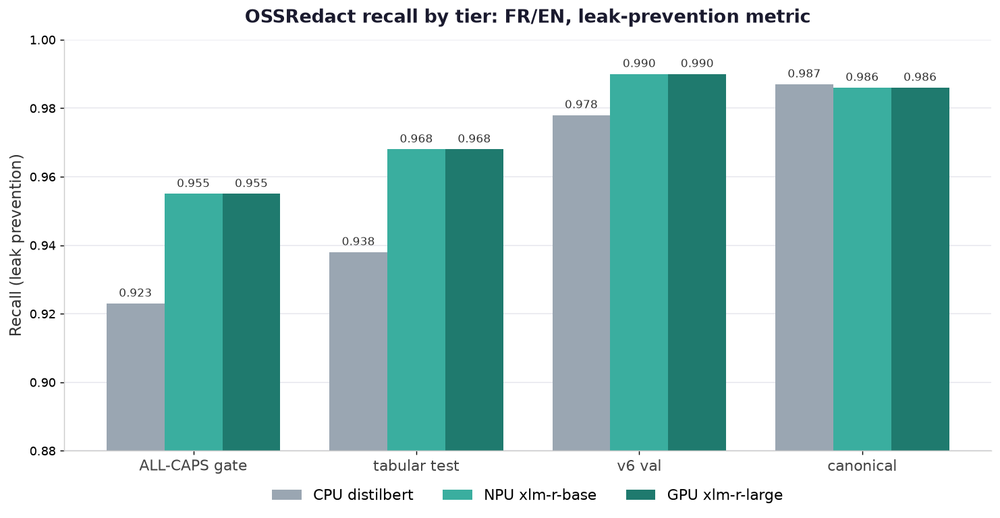
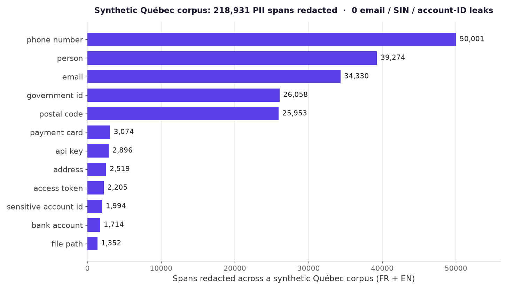

# OSSRedact

**A local privacy gateway that strips PII and secrets before they reach a cloud LLM, and puts them back in the reply.**

OSSRedact is an HTTP proxy that sits in front of cloud LLM APIs. On the way out it redacts PII and secrets in the request's free-text fields to stable placeholders. On the way back it rehydrates those placeholders into the real values. Your local tool sees real data the whole time; the cloud model only ever sees placeholders. Claude Code and Codex are verified today, and OpenAI/Anthropic-compatible tools such as Hermes, Pi, omp, and opencode route through the same documented adapters. The detection model runs locally on-device (CPU INT8 always-on; NPU/OpenVINO alternate), so no detection call ever leaves your machine.



*Higher recall than Microsoft Presidio on held-out Quebec FR/EN PII, with zero false positives on clean text -- full benchmarks below.*

## Why

Going fully local for data sovereignty is too expensive: SOTA-quality local inference needs 256GB+ of VRAM. OSSRedact takes the other path. Filter the private data out, use cloud SOTA, redact on egress and rehydrate transparently. Two users:

1. **The hobbyist** who wants data sovereignty but cannot justify a GPU rig. Keep using cloud Claude, keep your data home.
2. **The employee** who unknowingly leaks client PII into ChatGPT or Claude. OSSRedact is always-on DLP that catches it before it ships.

## How it works

The request pipeline, in order:

```
client (real data)
   |
   v
1. Extract redactable text fields (system, messages, tool_result text).
   Never touches tool_use input, tool schemas, images, or model name.
   |
   v
2. Tier-0 deterministic gate, ALWAYS, in microseconds:
   regex + Luhn PII, secrets + entropy scan.
   |
   v
3. Empty path: if there is no scannable text and no prior session entity to backstop,
   forward unchanged.
   |
   v
4. On-device NER pass over every extracted non-trivial text field.
   Repeated system prompts / prior turns are cached, but short structural
   values are still scanned so person names have a chance to be caught.
   |
   v
5. Union merge (connected-component, no fragment leaks) +
   session/project entity map (AES-GCM at rest). Same value maps to the
   same placeholder across turns. A known-entity backstop re-redacts any
   value once identified, even if the model later misses it.
   |
   v
6. Forward upstream, auth header verbatim.
   |
   v
7. Stream-rehydrate the SSE response: reassemble placeholders split across
   deltas, rehydrate tool_use argument JSON at the value level.
   |
   v
client receives the real values back
```

**Policy.** PII config is per-project and per-session (session overrides project overrides default). Secrets and credentials (`api_key`, `password`, `access_token`) **always** redact, regardless of policy. Operational labels (`file_path`, `username`, `organization`) are excluded by default so the coding use case keeps working. Git commit and content hashes (40/64 hex) are allowlisted and never redacted.

## Quickstart

Point any tool at the proxy. Under a Claude Max subscription, billing stays on Max, no API key needed: the auth header is forwarded verbatim.

```bash
export ANTHROPIC_BASE_URL=http://<host>:8011
claude
```

That is it. Your Claude Code session now redacts on egress and rehydrates on the response, transparently.

Anthropic `/v1/messages`, OpenAI-compatible `/v1/chat/completions` (Codex, omp, Hermes, Pi, opencode), and OpenAI `/v1/responses` (current Codex) are supported today, through the same redact/rehydrate contract. Tool-specific wiring is documented in `docs/ADAPTERS.md`. (The egress-proxy code lives under `appliance/` and the GPU NER gate service it calls under `gate/`; both are version-controlled, with `deploy/check-gate-drift.sh` guarding host-vs-repo drift -- F6 closed.)

## What it catches

**Repo scope vs deployed appliance.** This repository contains the detection library and CLI (`gate/privacy_gate.py`: Tier-0 regex+Luhn floor, NER tier wrappers, merge, redact/rehydrate), the training code, the validation code, and the egress proxy (`appliance/`: the `:8011` always-on gateway, SSE stream rehydration, the AES-GCM session/project entity map, the known-entity backstop, and the deterministic secrets/entropy layer described in the pipeline above). The GPU NER gate service (`gate/gate_service_gpu.py`) is now version-controlled here too; the running instance is deployed on the GPU host, with `deploy/check-gate-drift.sh` guarding host-vs-repo drift (F6 closed).

**Tier-0 deterministic floor (always on, in the deployed appliance).** Regex + Luhn for the catastrophic structured categories, plus a deterministic secrets layer: ported gitleaks-style patterns and a Shannon-entropy backstop, with UUID / git-SHA / sequential false-positive filters. This layer is the reliable floor and runs on every request.

**NER suite, 3 tiers, French-Quebec + English focus.** The bilingual Quebec PII focus is the moat: competitors use generic English-first detectors.

| Tier | Model | Notes |
|------|-------|-------|
| CPU | xlm-roberta-base | the deployed always-on workhorse, dynamic-INT8 ONNX on CPU (onnxruntime) |
| CPU | distilbert-multilingual | 135MB static-INT8, the most portable tier |
| NPU | xlm-roberta-base | preserved drop-in alternate, OpenVINO FP16 IR on the Intel NPU (alternate tier) |
| GPU | xlm-roberta-large | highest-capacity tier |

**20 labels** (shipped model, `training/labels_v20.json`): `account_number`, `address`, `card_cvv`, `card_expiry`, `date_of_birth`, `email`, `file_path`, `government_id`, `iban`, `ip_address`, `organization`, `password`, `payment_card`, `person`, `phone_number`, `postal_code`, `secret`, `sensitive_account_id`, `tax_id`, `username`.

The prior 23-label scheme was consolidated: `bank_account` + `routing_number` folded into `account_number` / `sensitive_account_id`; `api_key` + `access_token` folded into `secret` / `password`; `sensitive_date` folded into `date_of_birth`; `phone` renamed `phone_number`; `postal` renamed `postal_code`; `ip` renamed `ip_address`.

## Benchmarks

Recall is the leak-prevention rate. clean_fp is the count of over-redactions on negative (clean) rows.

**Current model: v11 (real-structure held-out, 5-round error-mine loop).** Measured on `pii-heldout-v11r5` (7,498 synthetic rows, 0 train overlap, unseen document structures). Source: `validation/RESULT-v11.md`.

The privacy metric is **full-stack catastrophic DETECTION recall**: any detected span is redacted regardless of which label it gets -- an intra-catastrophic mislabel is still a redaction, not a leak.

| pick | base | catastrophic full-stack DETECTION | overall labeled R | overall P | clean_fp |
|------|------|-----------------------------------|-------------------|-----------|----------|
| GPU  | xlm-r-large-v11r5 | **0.9964** | 0.9785 | 0.9598 | 12 / 7498 rows |
| CPU  | xlm-r-base-v11r5  | **0.9932** | 0.9664 | 0.9456 | 12 / 7498 rows |

Published model ids (HuggingFace, publication targets): `ZenSystemAI/pii-xlmr-large` (GPU) and `ZenSystemAI/pii-xlmr-base` (CPU INT8 / in-browser). `v11rN` is the weight revision (an HF revision tag), not part of the repo id; figures above are `v11r5`.

Every catastrophic label is caught at >=0.974 full-stack detection (large); 11 of 13 at 1.000. FR is not weaker than EN (FR R=0.980, EN R=0.978): the Quebec-French moat holds on unseen structure.

**Latency:** clean fast-path 1.7ms median; PII-bearing request 23.5ms median; on-device about 34ms per 256-token window.

### v6/v7 historical (superseded by v11 -- see validation/RESULT-v11.md)

Earlier results on the v6 generation sets (in-distribution held-out, train and val shared document layouts). Kept for reference; **do not use these as current figures**.

**NER vs Microsoft Presidio** (English + French large spaCy, union, same sets, same metric) -- charted at the top:

| Set | OSSRedact recall | Presidio recall | OSSRedact clean_fp | Presidio clean_fp |
|-----|---------------|-----------------|-----------------|-------------------|
| ALL-CAPS gate | 0.955 | 0.779 | 0 | - |
| v6 val | 0.990 | 0.759 | 0 | 343 |
| canonical | 0.986 | 0.798 | 0 | 508 |

OSSRedact wins recall by 17 to 23 points **and** has far fewer false positives.

**Recall by tier (v6/v7):**



- NPU xlm-r-base: 0.955 (ALL-CAPS gate), 0.968 (tabular), 0.990 (v6 val), 0.986 (canonical); clean_fp 0.
- GPU xlm-r-large: identical recall to NPU (0.955 ALL-CAPS gate, 0.990 v6 val); clean_fp 0.
- CPU distilbert: 0.923 / 0.938 / 0.978 / 0.987; clean_fp 0 to 2.

**The key finding: the base model equals GPU large on recall at about 4x lower latency.** That is why the base model is the always-on tier (deployed as CPU INT8).

## Synthetic-corpus validation



**Synthetic Québec corpus.** A generated corpus of 5,000 French-Québec + English documents (bank statements, financing forms, email threads, CSV exports, `.env` files, and code) was redacted entirely locally on the gate. **218,931 PII spans redacted, with zero email, SIN, account-ID, or credit-card leaks** in the redacted output, verified against ground truth.

100% synthetic: every name, SIN, account, and secret is fabricated, so the corpus can be generated and re-run anywhere with no real-data exposure. It deliberately includes adversarial cases (ALL-CAPS, NBSP-separated IDs, mixed FR/EN, long unbroken lines, look-alike decoys). One of these surfaced a gap where NBSP-separated SINs in cue-less cells bypassed the deterministic floor; it was fixed (the floor now normalizes unicode spaces) and re-verified at zero SIN leaks.

**C2, code-context PII (synthetic).** 100% recall across JSON, YAML, SQL, CSV, logs, .env, and code comments, in both French and English. The adversarial variant (full names glued into camelCase / snake_case identifiers) scored 0.882.

## Limitations

State plainly:

- Models are trained and validated entirely on synthetic Québec data. Broader real-world domains are future work.
- Full names glued into code identifiers are under-detected (0.882 on the adversarial set).
- Bare long transaction-reference digit runs adjacent to letters can be missed.
- French and English only by design. Multilingual is an explicit future axis, not v1.
- Recall is below 100%. The deterministic Tier-0 layer is the reliable floor for the catastrophic categories (secrets, cards, SIN); the NER tiers raise coverage on top of it.

## Prior art

The redaction-proxy concept already exists. [og-local / OutGate](https://github.com/outgate-ai/og-local) (BSL license) and rehydra-sdk (MIT) both proxy these wire formats with round-trip streaming rehydration.

OSSRedact's distinct contribution:

- A **trained French-Quebec + English PII NER model** (competitors use generic Presidio / regex).
- Running the model **locally on-device** (CPU INT8 always-on; NPU/OpenVINO alternate): no cloud detection call, true data sovereignty.
- An always-on **deterministic secrets + structured-PII floor**.
- **Quebec Law 25** framing.

OSSRedact does not claim to be first or only at the proxy pattern.

## Status

The Track A appliance is built, running as a systemd service, and verified end-to-end: a real Claude Code session through the proxy redacts and rehydrates transparently. **Not yet published.** The workbench UI is built. Anthropic `/v1/messages`, OpenAI-compatible `/v1/chat/completions`, and OpenAI `/v1/responses` adapters are live; CLI wiring for Codex, Hermes, Pi, omp, and opencode is documented in `docs/ADAPTERS.md`.
