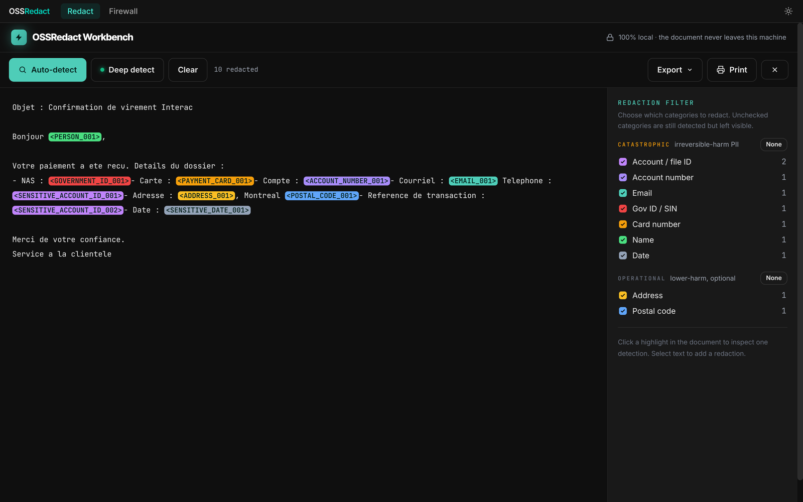
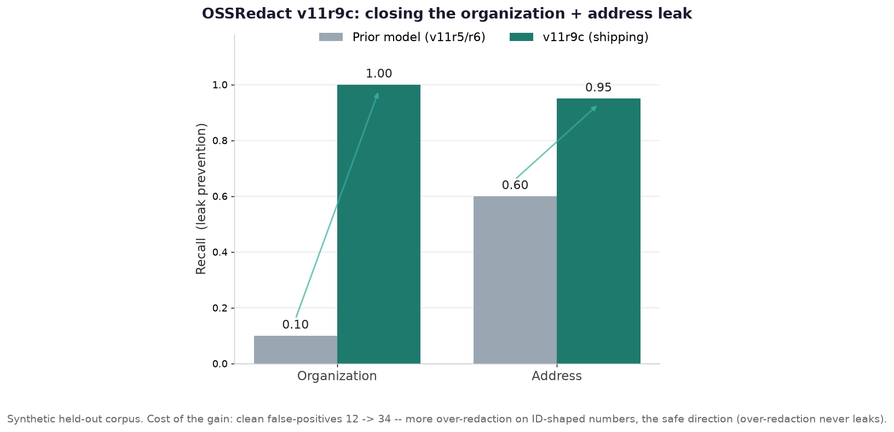

# OSSRedact

[](https://github.com/ZenSystemAI/OSSRedact/actions/workflows/ci.yml)
[](https://www.npmjs.com/package/@ossredact/core)
[](https://huggingface.co/ZenSystemAI)
[](LICENSE)

**A local privacy gateway that strips PII and secrets before they reach a cloud LLM, and puts them back in the reply.**

- **Use cloud SOTA, keep your data home.** No 256GB GPU rig required -- filter the private data out, let the cloud model work on placeholders, get the real values back transparently.
- **Hand the AI a key it can use but never sees.** Your tool works with real data the whole time; the cloud model only ever receives `<PERSON_003>` and `<SECRET_001>`.
- **A hard secret floor.** Deterministic detection (regex + Luhn + entropy) for secrets, payment cards, IBANs, and government IDs -- model-independent and always on, running on every request in every mode (including `Off`). It is cue-/shape-anchored rather than omniscient (see Limitations), but for these structured categories it does not depend on the model.
- **Local and bilingual.** Detection runs on-device, so no detection call ever leaves your machine -- trained for French-Quebec + English, where generic English-first detectors fall short.
- **Watch it work.** A loopback-only console shows, per request, each real value -> the placeholder the cloud sees, and each placeholder -> your real value on the reply.

OSSRedact is an HTTP proxy that sits in front of cloud LLM APIs. On the way out it redacts PII and secrets in the request's free-text fields to stable placeholders. On the way back it rehydrates those placeholders into the real values. Your local tool sees real data the whole time; the cloud model only ever sees placeholders in the fields the gateway scans (reasoning/thinking blocks pass through opaque -- see Limitations). Claude Code and Codex are both verified end-to-end -- Codex on the OpenAI API-key path and on the ChatGPT/Codex-plan path (the gate routes plan requests, identified by the `chatgpt-account-id` header, to the ChatGPT backend; `GATEWAY_CHATGPT_UPSTREAM` overrides it). OpenAI/Anthropic-compatible tools such as Hermes, Pi, omp, and opencode route through the same documented adapters. The detection model runs locally on-device (CPU INT8 always-on; NPU/OpenVINO alternate), so no detection call ever leaves your machine.



*The Workbench after a deep detect on a French banking document: name, SIN, cards, accounts, address, and dates become stable placeholders, entirely in-browser. Try it live (works offline once loaded) at [ossredact.dev/app](https://ossredact.dev/app/).*


*Historical v6/v7 comparison against Microsoft Presidio on held-out Quebec FR/EN PII. Current measured v11 numbers are below.*

## Why

Going fully local for data sovereignty is too expensive: SOTA-quality local inference needs 256GB+ of VRAM. OSSRedact takes the other path. Filter the private data out, use cloud SOTA, redact on egress and rehydrate transparently. Two users:

1. **The hobbyist** who wants data sovereignty but cannot justify a GPU rig. Keep using cloud Claude, keep your data home.
2. **The employee** who unknowingly leaks client PII through configured CLI/API-endpoint clients today. Browser and desktop-app interception are roadmap items, not current coverage.

## How it works

The request pipeline, in order:

```
client (real data)
   |
   v
1. Extract redactable text fields (system, messages, tool_result text/JSON,
   tool_use input, document text, and tool schema descriptions/literal values).
   Never rewrites tool/function names, schema property names, images, binary file bytes, or model name.
   |
   v
2. Tier-0 deterministic gate, ALWAYS, in microseconds:
   regex + Luhn PII, secrets + entropy scan.
   |
   v
3. Empty path: if there is no scannable text and no prior session entity to backstop,
   forward unchanged.
   |
   v
4. On-device NER pass over every extracted non-trivial text field.
   Repeated system prompts / prior turns are cached, but short structural
   values are still scanned so person names have a chance to be caught.
   |
   v
5. Union merge (connected-component, no fragment leaks) +
   session/project entity map (AES-GCM at rest). Same value maps to the
   same placeholder across turns. A known-entity backstop re-redacts any
   value once identified, even if the model later misses it.
   |
   v
6. Forward upstream, auth header verbatim.
   |
   v
7. Stream-rehydrate the SSE response: reassemble placeholders split across
   deltas, rehydrate tool_use argument JSON at the value level.
   |
   v
client receives the real values back
```

**Policy.** PII config is per-project and per-session (session overrides project overrides default). A single **redaction mode** sets the overall stance, toggleable live from the console:

- **Privacy** (default) -- redact all detected PII, organizations included.
- **Coding** -- additionally let organization/framework names (`React`, `PostgreSQL`, an employer name), bind/localhost IP literals, and UUID-shaped session/request ids through, so an AI coding agent keeps its context and its file/session plumbing keeps working; names, addresses, emails, phones and the floor still redact.
- **Off** -- pass soft PII (names, addresses, emails) through, for when redaction gets in the way.

Bare dates and version strings never redact at the egress in **any** mode (they are the highest-volume false-positive class on real traffic and identify nobody on their own; set `GATEWAY_REDACT_DATES=1` to restore date redaction in Privacy mode). The Workbench keeps its own per-label date filter for document review.

The **deterministic floor is never disableable by any mode**: secrets and credentials, payment cards, IBANs/bank accounts, government/tax IDs, and date of birth **always** redact -- so even `Off` can never leak a credential or a money/government identifier. Floor status requires deterministic provenance: a floor-class guess coming only from the neural model is demoted to a soft `sensitive_ref` span (still redacted in Privacy and Coding, but allowlist-exemptible and safe to rehydrate into tool arguments). The `username` label is excluded by default and file paths are narrowed to the home-dir username (`GATEWAY_PATH_POLICY`) so the coding use case keeps working; git commit and content hashes (40/64 hex) are allowlisted and never redacted.

## Quickstart

Point any tool at the proxy. Under a Claude Max subscription, billing stays on Max, no API key needed: the auth header is forwarded verbatim.

```bash
export ANTHROPIC_BASE_URL=http://127.0.0.1:8011
claude
```

That is it -- *once the appliance is running*. The two services (the NER engine on `:8001` and the egress proxy on `:8011`) and the model weights have to be installed first; see **[QUICKSTART.md](QUICKSTART.md)** for the one-time setup. With the appliance up, your Claude Code session redacts on egress and rehydrates on the response, transparently.

Open `http://127.0.0.1:8011/` in a local browser for the **console**: a do-not-redact dictionary editor and a **live activity** view that shows, per request, each real value → the placeholder the cloud sees and each placeholder → your real value on the reply -- visual proof the firewall is working on your own sessions. It is loopback-only and kept in memory (`GATEWAY_LIVE_VIEW=0` to disable).

Anthropic `/v1/messages`, OpenAI-compatible `/v1/chat/completions` (Codex, omp, Hermes, Pi, opencode), and OpenAI `/v1/responses` (current Codex) are supported today, through the same redact/rehydrate contract. Tool-specific wiring is documented in `docs/ADAPTERS.md`. The TypeScript redaction core the Workbench shares (deterministic Tier-0 floor, span merge, placeholder/restore round-trip) is published standalone as [`@ossredact/core`](https://www.npmjs.com/package/@ossredact/core). (The egress-proxy code lives under `appliance/` and the GPU NER gate service it calls under `gate/`; both are version-controlled, with `deploy/check-gate-drift.sh` guarding host-vs-repo drift.)

## Desktop app

One app, two surfaces, one codebase (`workbench/`) -- shipped both as a static web build (runs in any browser, no install) and as a Tauri tray app.

- **Redact** -- a document-redaction workbench. Drop a `.pdf` / `.docx` / `.xlsx` / `.txt` / `.md` / `.csv` / `.json`, or paste text; PII is detected and masked **entirely in the browser**, so the document never leaves the machine. The deterministic **Tier-0 floor** (secrets, payment cards, IBANs, IDs -- regex + Luhn/mod-97) runs in-browser with no model at all; the in-browser **neural** tier loads when its INT8 weights are staged at `/model/` (the hosted demo and packaged builds bundle them -- a bare `npm run dev` of this repo serves the Tier-0 floor only). Format-preserving export, click-to-inspect provenance, batch processing with a shared map, and round-trip restore of a redacted copy.
- **Firewall** -- the console for the always-on proxy: a **Connect** tab with copy-paste setup for Claude Code / Codex, the **live activity** proof (each real value to the placeholder the cloud sees, and back), the **do-not-redact and always-redact dictionaries**, and the **Privacy / Coding / Off** mode switch. It talks to the local daemon and degrades gracefully to a "start the firewall" prompt when none is running.

**Light and dark theme**, following your OS preference. As a native app it is **tray-resident** (minimize to tray, optional launch-on-login), with the egress daemon running as a separate background service the app connects to. Build installers with `npm run app:build` (a Linux `.deb` is provided; macOS/Windows build from the same scaffold). The Firewall console is also served by the daemon itself at `http://127.0.0.1:8011/` with no app install at all.

## What it catches

**Repo scope vs deployed appliance.** This repository contains the detection library and CLI (`gate/privacy_gate.py`: Tier-0 regex+Luhn floor, NER tier wrappers, merge, redact/rehydrate), the training code, the validation code, and the egress proxy (`appliance/`: the `:8011` always-on gateway, SSE stream rehydration, the AES-GCM session/project entity map, the known-entity backstop, and the deterministic secrets/entropy layer described in the pipeline above). The GPU NER gate service (`gate/gate_service_gpu.py`) is now version-controlled here too; the running instance is deployed on the GPU host, with `deploy/check-gate-drift.sh` guarding host-vs-repo drift.

**Tier-0 deterministic floor (always on, in the deployed appliance).** Regex + Luhn for the catastrophic structured categories, plus a deterministic secrets layer: ported gitleaks-style patterns and a Shannon-entropy backstop, with UUID / git-SHA / sequential false-positive filters. This layer is the reliable floor and runs on every request.

**NER suite, 3 tiers, French-Quebec + English focus.** The bilingual Quebec PII focus is the moat: competitors use generic English-first detectors.

| Tier | Model | Notes |
|------|-------|-------|
| CPU | xlm-roberta-base | the deployed always-on workhorse, dynamic-INT8 ONNX on CPU (onnxruntime) |
| NPU | xlm-roberta-base | preserved drop-in alternate, OpenVINO FP16 IR on the Intel NPU (alternate tier) |
| GPU | xlm-roberta-large | highest-capacity tier |

**20 labels** (shipped model, `training/labels_v20.json`): `account_number`, `address`, `card_cvv`, `card_expiry`, `date_of_birth`, `email`, `file_path`, `government_id`, `iban`, `ip_address`, `organization`, `password`, `payment_card`, `person`, `phone_number`, `postal_code`, `secret`, `sensitive_account_id`, `tax_id`, `username`.

The prior 23-label scheme was consolidated: `bank_account` + `routing_number` folded into `account_number` / `sensitive_account_id`; `api_key` + `access_token` folded into `secret` / `password`; `sensitive_date` folded into `date_of_birth`; `phone` renamed `phone_number`; `postal` renamed `postal_code`; `ip` renamed `ip_address`.

## Benchmarks

Recall is the leak-prevention rate. clean_fp is the count of over-redactions on negative (clean) rows.

**Measured public benchmark: both tiers ship v11r9c (synthetic held-out corpus).** Measured on the synthetic held-out corpus (7,498 rows, 0 train overlap, unseen document structures). Source: `validation/RESULT-v11r9c.md` (the v11r5 baseline it improves on is `validation/RESULT-v11.md`).

The privacy metric is **full-stack catastrophic DETECTION recall**: any detected span is redacted regardless of which label it gets -- an intra-catastrophic mislabel is still a redaction, not a leak.

| pick | base | catastrophic full-stack DETECTION | overall labeled R | overall P | clean_fp |
|------|------|-----------------------------------|-------------------|-----------|----------|
| GPU  | xlm-r-large-v11r9c | **0.9954** | 0.9882 | 0.9615 | 34 / 7498 rows |
| CPU  | xlm-r-base-v11r9c | **0.9941** | 0.9777 | 0.9139 | 48 / 7498 rows |



*Benchmark basis: synthetic held-out corpus (`pii-heldout`, 7,498 rows, 20 labels), "full" config (Tier-0 floor + neural model), 597 no-PII negatives for clean_fp. The GPU/large row is the shipping `v11r9c` revision; the CPU/base row is also the `v11r9c` revision.*

Published models, live on HuggingFace: [`ZenSystemAI/ossredact-pii-large`](https://huggingface.co/ZenSystemAI/ossredact-pii-large) (GPU) and [`ZenSystemAI/ossredact-pii-base`](https://huggingface.co/ZenSystemAI/ossredact-pii-base) (CPU INT8 / in-browser). `v11rN` is the weight revision (an HF revision tag), not part of the repo id. Both the GPU/large and CPU/base figures are the `v11r9c` revision; the base ships as per-channel dynamic INT8 (the WASM-native in-browser format) at pii_argmax 0.967 vs fp32 -- a hair under the original 0.97 parity bar, which was relaxed to 0.965 to ship this export. The shortfall is acceptable because the flips are mostly on Tier-0-floor-protected tokens (redacted regardless of the model) and `account_number` is the one neural-only watch-item -- full analysis in `validation/RESULT-base-int8-parity-v11r9c.md`.

**What changed in v11r9c (GPU/large).** v11r9c closes the structural-form organization and address leak that the prior revision missed: organization recall ~0.10 → 1.00 and address recall ~0.60 → 0.95 on the synthetic held-out corpus, with `sensitive_account_id` nudged 0.9983 → 0.9993. The cost is a little more over-redaction on digit-ID-shaped tokens (clean_fp 12 → 34; per-label precision dips on `government_id` ~0.87, `phone_number` ~0.84, `sensitive_account_id` ~0.88, `account_number` ~0.94, `date_of_birth` ~0.96). This is the safe failure direction: over-redaction never leaks PII, it only costs a coding agent a little context when a benign number is ID-shaped. For a privacy firewall whose prime directive is "never leak," closing the org/address leak is the right trade.

Every catastrophic label is caught at >=0.974 full-stack detection (large); 10 of 13 at 1.000, the three exceptions being `person` 0.9946, `sensitive_account_id` 0.9993, and `account_number` 0.974 (the one neural-only watch-item). FR is not weaker than EN (FR R=0.980, EN R=0.978): the Quebec-French moat holds on unseen structure.

**Latency:** clean fast-path 1.7ms median; PII-bearing request 23.5ms median; on-device about 34ms per 256-token window.

### v6/v7 historical (superseded by v11 -- see validation/RESULT-v11.md)

Earlier results on the v6 generation sets (in-distribution held-out, train and val shared document layouts). Kept for reference; **do not use these as current figures**.

**NER vs Microsoft Presidio** (English + French large spaCy, union, same sets, same metric) -- charted at the top:

| Set | OSSRedact recall | Presidio recall | OSSRedact clean_fp | Presidio clean_fp |
|-----|---------------|-----------------|-----------------|-------------------|
| ALL-CAPS gate | 0.955 | 0.779 | 0 | - |
| v6 val | 0.990 | 0.759 | 0 | 343 |
| canonical | 0.986 | 0.798 | 0 | 508 |

OSSRedact wins recall by 17 to 23 points **and** has far fewer false positives.

**Recall by tier (v6/v7):**

- NPU xlm-r-base: 0.955 (ALL-CAPS gate), 0.968 (tabular), 0.990 (v6 val), 0.986 (canonical); clean_fp 0.
- GPU xlm-r-large: identical recall to NPU (0.955 ALL-CAPS gate, 0.990 v6 val); clean_fp 0.

**The key finding: the base model equals GPU large on recall at about 4x lower latency.** That is why the base model is the always-on tier (deployed as CPU INT8).

## Synthetic-corpus validation


**Synthetic Québec corpus.** A generated corpus of 5,000 French-Québec + English documents (bank statements, financing forms, email threads, CSV exports, `.env` files, and code) was redacted entirely locally on the gate. **218,931 PII spans redacted, with zero email, SIN, account-ID, or credit-card leaks on our synthetic held-out corpus** in the redacted output, verified against ground truth. (This is a synthetic-corpus result, not a real-world zero-leak guarantee.)

100% synthetic: every name, SIN, account, and secret is fabricated, so the corpus can be generated and re-run anywhere with no real-data exposure. It deliberately includes adversarial cases (ALL-CAPS, NBSP-separated IDs, mixed FR/EN, long unbroken lines, look-alike decoys). One of these surfaced a gap where NBSP-separated SINs in cue-less cells bypassed the deterministic floor; it was fixed (the floor now normalizes unicode spaces) and re-verified at zero SIN leaks.

**C2, code-context PII (synthetic).** 100% recall across JSON, YAML, SQL, CSV, logs, .env, and code comments, in both French and English. The adversarial variant (full names glued into camelCase / snake_case identifiers) scored 0.882.

## Limitations

State plainly:

- Models are trained and validated entirely on synthetic Québec data. Broader real-world domains are future work.
- Full names glued into code identifiers are under-detected (0.882 on the adversarial set).
- Bare long transaction-reference digit runs adjacent to letters can be missed.
- French and English only by design. Multilingual is an explicit future axis, not v1.
- Secret detection covers keyword-cued assignments (English and French -- `motdepasse`/`mdp`/`jeton`/`clé`), known provider key shapes, connection strings, and an AWS-secret-shaped entropy backstop. A novel **opaque** token with no keyword cue and no recognizable shape (e.g. a bare high-entropy bearer value) can pass -- the entropy backstop is deliberately false-positive-filtered so it does not nuke ordinary code.
- The CVV / PIN / short-numeric-secret floor is **cue-anchored**: a value force-redacts when it sits under a recognized key (`cvv`, `password`, `pin`, `account_pin`, `ssn`, ... -- as text *or* a native JSON number) or beside a text cue (`cvv: 834`, `"cvv": 834`, `NIP 4821`). A bare 3-4 digit number with no key and no cue is intentionally left alone -- redacting every short number would be unusable -- so such values rely on a recognized field name/cue or the NER tier.
- Identifier coverage targets **Canadian / Québec** formats (SIN, RAMQ, NEQ, postal codes, ...). Foreign formats (e.g. US ZIP codes, Brazilian CPF) are not specifically detected.
- Recall is below 100%. The deterministic Tier-0 layer is the reliable floor for the catastrophic categories (secrets/API keys, payment cards via Luhn, IBAN, SIN/government IDs, emails, IP addresses, file paths); the NER tiers raise coverage on top of it.
- **Address and Organization have no deterministic Tier-0 floor** -- they rely entirely on the NER model. The GPU/large `v11r9c` revision now covers them well on the synthetic held-out corpus (organization 1.00, address 0.95), but this is model-dependent, not a hard guarantee like the Tier-0 categories. The CPU/base `v11r9c` tier now also carries this augmentation (address ~0.93); organization coverage may still trail the large tier, so use the large tier when organization recall matters.
- **Reasoning/thinking blocks pass through opaque, not re-scanned.** Extended-thinking blocks (Anthropic `thinking` / `redacted_thinking`) and OpenAI reasoning `encrypted_content` are cryptographically bound -- a `signature` MAC over the thinking content, or an encrypted blob -- and must round-trip to the upstream **byte-for-byte** (mutating them breaks the signature / decryption, which is why the gateway forwards them unchanged). They are therefore **not** scanned for redaction. In a gated session this is safe: the model generated them from already-redacted input, so they only ever contain placeholders -- but the gate does not independently re-verify that, so real data a client deliberately injected into such a block would pass through. The redaction guarantee applies to the request's prompt / message / tool-argument free-text fields, which are scanned in full.

## Prior art

The redaction-proxy concept already exists. [og-local / OutGate](https://github.com/outgate-ai/og-local) (BSL license) and rehydra-sdk (MIT) both proxy these wire formats with round-trip streaming rehydration.

OSSRedact's distinct contribution:

- A **trained French-Quebec + English PII NER model** (competitors use generic Presidio / regex).
- Running the model **locally on-device** (CPU INT8 always-on; NPU/OpenVINO alternate): no cloud detection call, true data sovereignty.
- An always-on **deterministic secrets + structured-PII floor**.
- **Quebec Law 25** framing.

OSSRedact does not claim to be first or only at the proxy pattern.

## Status

The appliance is built, running as a systemd service, and verified end-to-end: a real Claude Code session through the proxy redacts and rehydrates transparently. **Not yet published.** The workbench UI is built. Anthropic `/v1/messages`, OpenAI-compatible `/v1/chat/completions`, and OpenAI `/v1/responses` adapters are live; CLI wiring for Codex, Hermes, Pi, omp, and opencode is documented in `docs/ADAPTERS.md`.

## License

MIT -- see [LICENSE](LICENSE). Copyright (c) 2026 ZenSystemAI.
